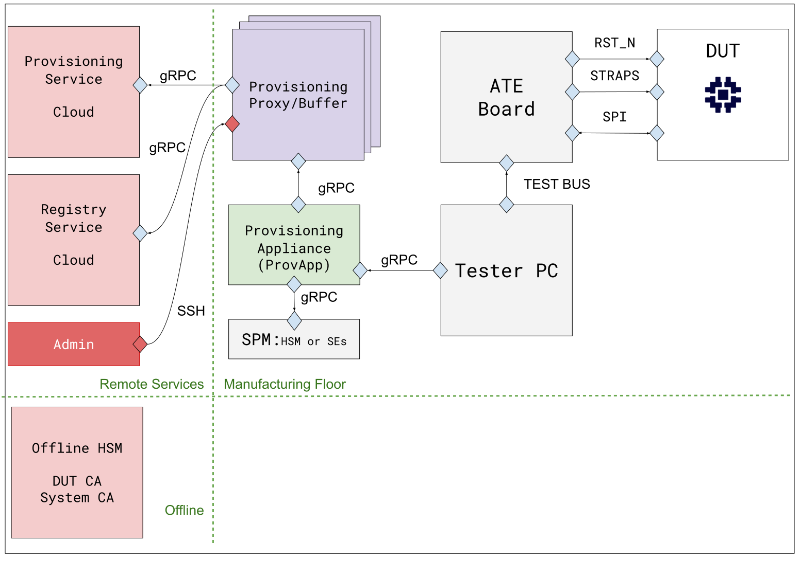
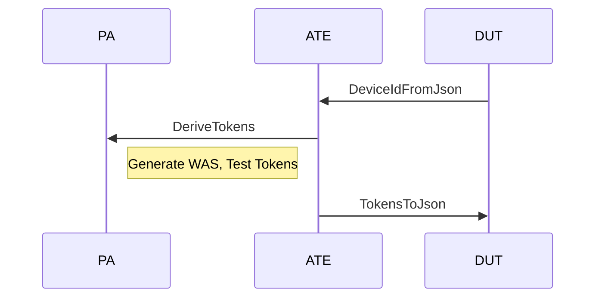
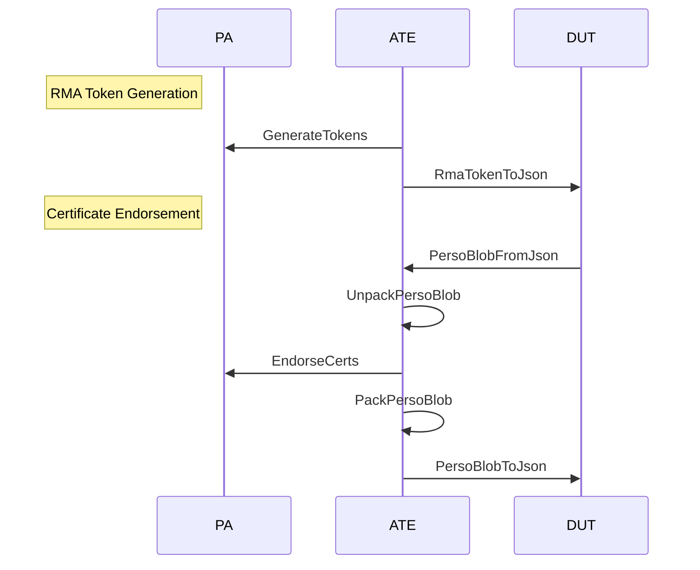

# Provisioning System

## Overview

The provisioning flow consists of two main stages: Chip Probe (CP) and Final
Test (FT). Each stage involves interactions between three main components:

* Provisioning Appliance (PA): The backend service that manages secure tokens
  and certificates
* Automated Test Equipment (ATE): The test framework that interfaces between PA
  and DUT
* Device Under Test (DUT): The OpenTitan device being provisioned

### Authentication and Session Management

Before any provisioning operations can begin:

1. The ATE client must establish a connection with the PA using:
  * Optional mTLA authentication (with client and host certificates)
  * SKU-specific authentication tokens
  * Session management via `InitSession` and `CloseSession` calls provided by
    the ate_api.h library.

### Chip Probe Stage

The Chip Probe (CP) stage handles initial device identification and test token
provisioning:

1. **Device Initialization**
  * ATE client performs device RAW unlock
  * ATE loads the CP SRAM configuration program on the Device Under Test (DUT)
    via JTAG.
  * DUT boots into CP mode.
2. **Token Derivation**
  * ATE requests three trokens from the Provisioning Appliance (PA):
    * Wafer Authentication Secret (WAS): 256-bit high security token.
    * Test Unlock Token: 128-bit low-security token.
    * Test Exit Token: 128-bit low-security token.
3. **Device ID Collection**
  * DUT generates and transmits its unique Device ID
  * ATE receives and validates the Device ID format

#### CP Sequence Diagram

### Final Test Stage

The Final Test Stage (FT) handles device personalization and production
preparation:

1. **Device State Transition**
  * ATE uses Test Unlock Token to transition the Device Under Test (DUT) to
    `TEST_UNLOCKED` state
  * ATE loads FT individualization fimrware via JTAG. This firmware is responsible
    for configuring most OTP non-secret settings, including the DUT secure boot
    root keys.
  * ATE uses Test Exit Token to transition to `PROD` state. Provisioning of device
    secrets is performed once all the debug and test interafaces have been
    disabled.
2. **RMA Token Generation**
  * ATE requests RMA token generation from the Provisioning Appliance (PA).
  * A hash of the RMA token is configured in the DUT's One Time Programmable
    (OTP) memory.
  * The plaintext RMA token is encrypted with a public key. The private key used
    to decrypt the token is held in an offline HSM.
  * RMA tokens are __not__ shared across DUTs.
  * RMA tokens are __not__ persisted in the Provisioning Appliance.
3. **Certificate Endorsement**
  * Device generates To-Be-Signed (TBS) certificate data. This includes
    DICE attestation certificates.
  * Device signs TBS data using a Wafer Authentication derived key.
  * ATE forwards TBS and signature to the Provisioning Appliance for endorsement
  * Provisioning Appliance validates signature and endorses certificates
  * ATE packages endorsed certificate and sends it back to the Device

#### FT Sequence Diagram

## Components

* [Provisioning Appliance](https://github.com/lowRISC/opentitan-provisioning/wiki/pa)
* [Secure Provisioning Module](https://github.com/lowRISC/opentitan-provisioning/wiki/spm)
* [Automated Test Equipment Client](https://github.com/lowRISC/opentitan-provisioning/wiki/ate)

## Infrastructure

* [Authentication](https://github.com/lowRISC/opentitan-provisioning/wiki/auth)
* [Containers](https://github.com/lowRISC/opentitan-provisioning/wiki/containers)
* [HSM Configuration](https://github.com/lowRISC/opentitan-provisioning/wiki/hsm)

## Development Guides

* [Contribution Guide](https://github.com/lowRISC/opentitan-provisioning/wiki/contributing)
* [Deployment Guide](https://github.com/lowRISC/opentitan-provisioning/wiki/deployment)
