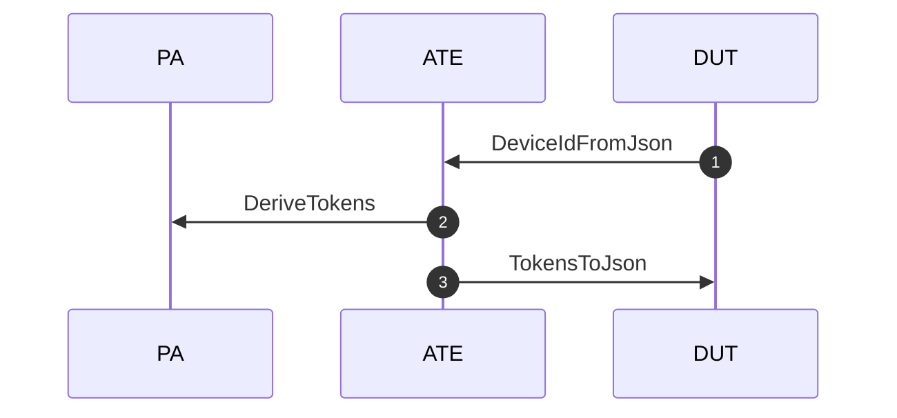
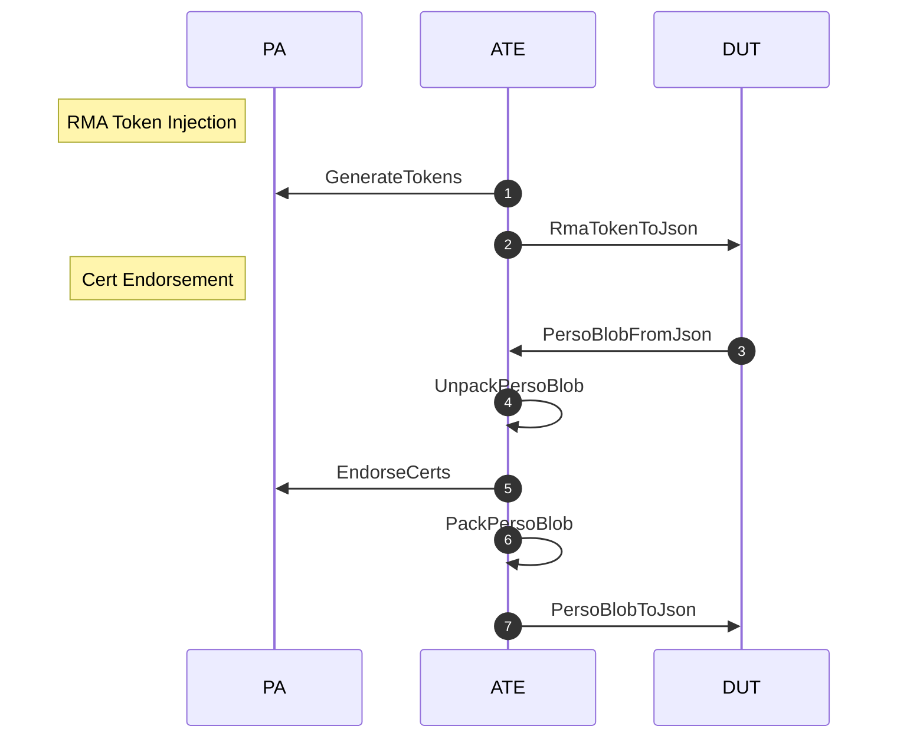

# Automated Test Equipment (ATE) Client

Standard ATE is used in various silicion manufacturing stages, as well as
for device provisioning. The ATE system generally runs on a PC system running
the Windows operating system.

The ATE client connects to the [Provisioning Appliance](https://github.com/lowRISC/opentitan-provisioning/wiki/pa) to perform
provisioning operations.

## Developer Notes

## Run ATE Client (Linux)

Run the following steps before proceeding.

* Generate [enpoint certificates](https://github.com/lowRISC/opentitan-provisioning/wiki/auth#endpoint-certificates).
* Start [PA server](https://github.com/lowRISC/opentitan-provisioning/wiki/pa#start-pa-server).

Take note of the PA server target address and port number. In the following
command we start the client pointing to `localhost:5001`.

```console
bazelisk build //src/ate:ate_main
bazel-bin/src/ate/ate_main \
    --target=localhost:5001 \
    --enable_mtls \
    --client_key=$(pwd)/config/dev/certs/out/ate-client-key.pem \
    --client_cert=$(pwd)/config/dev/certs/out/ate-client-cert.pem \
    --ca_root_certs=$(pwd)/config/dev/certs/out/ca-cert.pem
```

## Flows

### Chip Probe (CP)



### Final Test (FT)



## Read More

* [Provisioning Appliance](https://github.com/lowRISC/opentitan-provisioning/wiki/pa)
* [Documentation index](https://github.com/lowRISC/opentitan-provisioning/wiki/Home)
