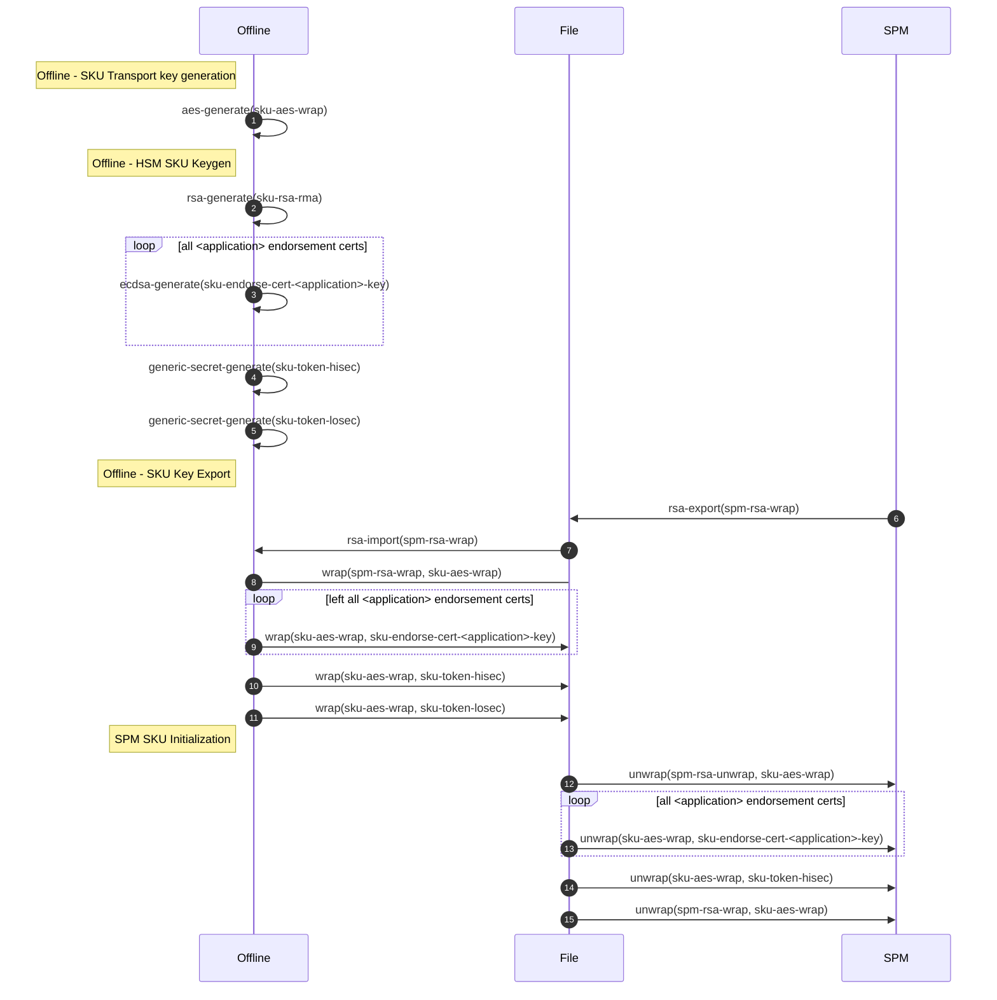

# HSM Configuration

This documents describes the `SPM` and `Offline` HSM configuration. The
following table summarizes all the assets managed across HSMs.

Asset | Offline | SPM | Type | Description
------|---------|-----|------|------------
`spm-<id>-rsa-wrap`, `spm-rsa-unwrap` | Public | Private |  RSA 3072bit-F4 key pair | Key used to wrap `<sku>-aes-wrap`. `<id>` is used to identify the SPM HSM.
`spm-hsm-id` | Public | Private | ECDSA P-384 key pair | Key used to attest SPM operations, e.g. Device records are signed with this key to attest their provenance.
`<sku>-aes-wrap` | Yes | Yes | AES 256-bit key | Key used to wrap SKU specific assets. `<sku>` is used to identify the SKU.
`<sku>-endorse-cert-<application>-key` | Private | Private | ECDSA key pair | Keys used in `EndorseCert` operations. `<sku>` is used to identify the SKU, `<application>` is used to track the certificate type.
`<sku>-token-hisec` | Yes | Yes | 256-bit Generic Secret | Key used in token generation operations. The key is expected to be rotated frequently. `sku` is used to identify the SKU.
`<sku>-token-losec` | Yes | Yes | 256-bit Generic Secret | Key used in token generation operations. The key is expected to be rotated infrequently. `sku` is used to identify the SKU.

## SPM HSM Initialization

All HSMs used for manufacturing are audited to ensure their policies and
overall configurations are aligned with product requirements. The following
assets are then provisioned into the HSM to enable SKU operations.


Asset | Type | Description
------|------|------------
`spm-<id>-rsa-wrap`, `spm-rsa-unwrap` | Public | Private |  RSA 3072bit-F4 key pair | Key used to wrap `<sku>-aes-wrap`. `<id>` is used to identify the SPM HSM.
`spm-hsm-id` | ECDSA P-384 key pair | Key used to attest SPM operations, e.g. Device records are signed with this key to attest their provenance.

## Offline HSM Initialization

### Transport Keys

The following keys are used to facilitate key wrap export of `SKU` specific
assets. All assets are exported with a wrapping key bound to a particular
`SPM`.

The HSM quorum is responsible for making sure that the `SPM` wrapping
key belongs to an HSM approved by the product owner.

Asset | Type | Description
------|------|------------
`<sku>-aes-wrap` | AES 256-bit key | Key used to wrap SKU specific assets. `<sku>` is used to identify the SKU.
`spm-<id>-rsa-wrap` | RSA 3072bit-F3 public key | Key used to wrap `<sku>-aes-wrap`. `<id>` is used to identify the SPM HSM.

Example:

```
sival-aes-wrap: Wrapping Key associated with Sival SKU.
spm-osat-rsa-wrap: SPM wrapping key bound to an HSM deployed at the OSAT.
```

### SKU Assets

The following assets are supported by the provisioning infrastructure. SKUs
may use one or more of the listed assets.

Asset | Type | Description
------|------|------------
`<sku>-endorse-cert-<application>-key` | ECDSA key pair | Keys used in `EndorseCert` operations. `<sku>` is used to identify the SKU, `<application>` is used to track the certificate type.
`<sku>-token-hisec` | 256-bit Generic Secret | Key used in token generation operations. The key is expected to be rotated frequently. `sku` is used to identify the SKU.
`<sku>-token-losec` | 256-bit Generic Secret | Key used in token generation operations. The key is expected to be rotated infrequently. `sku` is used to identify the SKU.

Example:

```
sival-endorse-cert-dice-key: DICE certificate endorsement key for the SiVal SKU.
sival-token-hisec: High security generic secret used for token generation.
sival-token-losec: Low security generic securet used for token generation.
```

##  End to End SKU Configuration

The following sequence diagram shows the end to end SKU provisioning flow
involving `Offline` and `SPM` HSMs.


