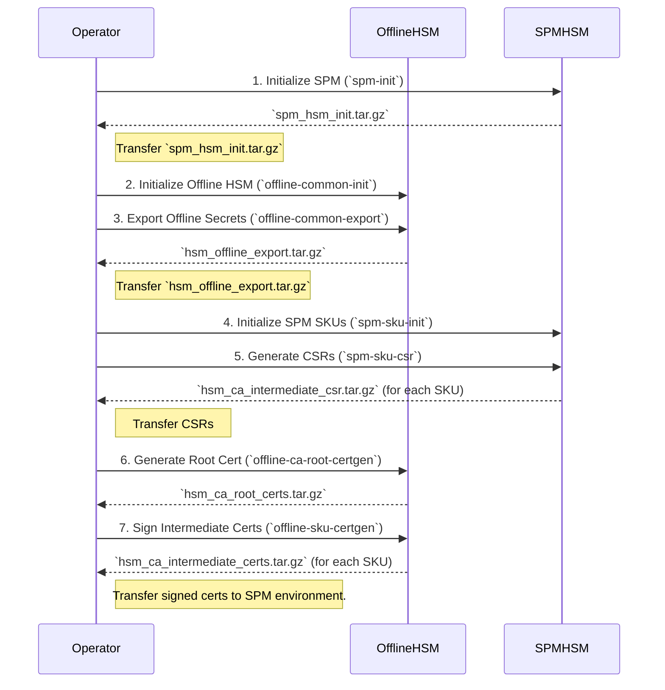

# HSM Configuration

This documents describes the `SPM` and `Offline` HSM configuration. The
following table summarizes all the assets managed across HSMs.

Asset | Offline | SPM | Type | Description
------|---------|-----|------|------------
`spm-rsa-wrap.pub`, `spm-rsa-wrap.priv` | Public | Private |  RSA 3072bit-F4 key pair | Key used to wrap `<sku>-aes-wrap`.
`spm-hsm-id` | Public | Private | ECDSA P-384 key pair | Key used to attest SPM operations, e.g. Device records are signed with this key to attest their provenance.
`<sku>-aes-wrap` | Yes | Yes | AES 256-bit key | Key used to wrap SKU specific assets. `<sku>` is used to identify the SKU.
`<sku>-endorse-cert-<application>-key` | Private | Private | ECDSA key pair | Keys used in `EndorseCert` operations. `<sku>` is used to identify the SKU, `<application>` is used to track the certificate type.
`<sku>-token-hisec` | Yes | Yes | 256-bit Generic Secret | Key used in token generation operations. The key is expected to be rotated frequently. `sku` is used to identify the SKU.
`<sku>-token-losec` | Yes | Yes | 256-bit Generic Secret | Key used in token generation operations. The key is expected to be rotated infrequently. `sku` is used to identify the SKU.

## SPM HSM Initialization

All HSMs used for manufacturing are audited to ensure their policies and
overall configurations are aligned with product requirements. The following
assets are then provisioned into the HSM to enable SKU operations.


Asset | Type | Description
------|------|------------
`spm-rsa-wrap.pub`, `spm-rsa-wrap.priv` | Public | Private |  RSA 3072bit-F4 key pair | Key used to wrap `<sku>-aes-wrap`.
`spm-hsm-id` | ECDSA P-256 key pair | Key used to attest SPM operations, e.g. Device records are signed with this key to attest their provenance.

## Offline HSM Initialization

### Transport Keys

The following keys are used to facilitate key wrap export of `SKU` specific
assets. All assets are exported with a wrapping key bound to a particular
`SPM`.

The HSM quorum is responsible for making sure that the `SPM` wrapping
key belongs to an HSM approved by the product owner.

Asset | Type | Description
------|------|------------
`<sku>-aes-wrap` | AES 256-bit key | Key used to wrap SKU specific assets. `<sku>` is used to identify the SKU.
`spm-rsa-wrap` | RSA 3072bit-F3 public key | Key used to wrap `<sku>-aes-wrap`.

Example:

```
sival-aes-wrap: Wrapping Key associated with Sival SKU.
spm-osat-rsa-wrap: SPM wrapping key bound to an HSM deployed at the OSAT.
```

### SKU Assets

The following assets are supported by the provisioning infrastructure. SKUs
may use one or more of the listed assets.

Asset | Type | Description
------|------|------------
`<sku>-endorse-cert-<application>-key` | ECDSA key pair | Keys used in `EndorseCert` operations. `<sku>` is used to identify the SKU, `<application>` is used to track the certificate type.
`<sku>-token-hisec` | 256-bit Generic Secret | Key used in token generation operations. The key is expected to be rotated frequently. `sku` is used to identify the SKU.
`<sku>-token-losec` | 256-bit Generic Secret | Key used in token generation operations. The key is expected to be rotated infrequently. `sku` is used to identify the SKU.

Example:

```
sival-endorse-cert-dice-key: DICE certificate endorsement key for the SiVal SKU.
sival-token-hisec: High security generic secret used for token generation.
sival-token-losec: Low security generic securet used for token generation.
```

## End to End SKU Provisioning Flow

The end-to-end SKU provisioning flow involves two physically separate HSMs: a
highly secure, air-gapped **Offline HSM** that protects the root of trust, and
an online **SPM (Secure Provisioning Module) HSM** used in the manufacturing
line.

An operator facilitates the secure transfer of cryptographic artifacts between
these two environments. The following diagram illustrates the complete flow.



The entire process is orchestrated by the `config/token_init.sh` script. The
following sections detail the responsibilities of each HSM operator.

---

### Phase 1: SPM HSM Operator - Initial Setup

The first phase begins in the SPM (online) environment.

#### **Step 1: Initialize SPM HSM**

This step generates the primary identity and wrapping keys on the SPM HSM.

```shell
# Ensure DEPLOY_ENV is set, e.g., "prod"
export DEPLOY_ENV=prod

./config/token_init.sh --action spm-init
```

*   **Description:** Creates the `spm-hsm-id` and `spm-rsa-wrap` key pairs on
    the SPM HSM. It then exports the public components.
*   **Output Artifact:** `spm_hsm_init.tar.gz`.
*   **Action:** The operator must securely transfer the `spm_hsm_init.tar.gz`
    file to the Offline HSM operator.

---

### Phase 2: Offline HSM Operator - Root of Trust Management

This phase takes place in the secure, offline environment.

#### **Step 2: Initialize Offline HSM**

This step creates the root CA private key and other critical secrets.

```shell
# Ensure DEPLOY_ENV is set, e.g., "prod"
export DEPLOY_ENV=prod

./config/token_init.sh --action offline-common-init
```

*   **Description:** Generates the root CA private key and RMA (Return
    Merchandise Authorization) keys. These keys never leave the Offline HSM.
*   **Input Artifact:** None.

#### **Step 3: Export Offline Secrets**

This step exports wrapped secrets for use by the SPM HSM. It is critical to use
the `--wipe` flag in this step.

```shell
./config/token_init.sh --action offline-common-export --wipe
```

*   **Description:** This script imports the SPM's public wrapping key from
    `spm_hsm_init.tar.gz` and uses it to wrap and export seeds and the RMA
    public key. The `--wipe` flag ensures that any previous SPM's wrapping key is
    deleted from the Offline HSM before running the export commands.
*   **Input Artifact:** `spm_hsm_init.tar.gz` (from Phase 1).
*   **Output Artifact:** `hsm_offline_export.tar.gz`.
*   **Action:** The operator must securely transfer `hsm_offline_export.tar.gz`
    back to the SPM HSM operator.

---

### Phase 3: SPM HSM Operator - SKU Initialization

This phase returns to the SPM (online) environment.

#### **Step 4: Initialize SPM with SKU Keys**

This step imports the wrapped secrets from the Offline HSM and generates
SKU-specific keys.

```shell
# Initialize for all desired SKUs
./config/token_init.sh \
  --action spm-sku-init \
  --sku sival \
  --sku cr01 \
  --sku pi01 \
  --sku ti01
```

*   **Description:** Imports the secrets from `hsm_offline_export.tar.gz`. It
    then generates the per-SKU intermediate CA private keys (e.g.,
    `sival-dice-key-p256`) on the SPM HSM.
*   **Input Artifact:** `hsm_offline_export.tar.gz` (from Phase 2).

#### **Step 5: Generate Intermediate CA CSRs**

This step generates Certificate Signing Requests (CSRs) for the intermediate
keys.

```shell
# Generate CSRs for all desired SKUs
./config/token_init.sh \
  --action spm-sku-csr \
  --sku sival \
  --sku cr01 \
  --sku pi01 \
  --sku ti01
```

*   **Description:** Uses the intermediate CA keys on the SPM HSM to create
    CSRs.
*   **Output Artifacts:** An `hsm_ca_intermediate_csr.tar.gz` file for each
    SKU's subdirectory (e.g.,
    `config/spm/sku/sival/hsm_ca_intermediate_csr.tar.gz`).
*   **Action:** The operator must collect all `hsm_ca_intermediate_csr.tar.gz`
    files and securely transfer them to the Offline HSM operator.

---

### Phase 4: Offline HSM Operator - Certificate Authority Actions

This final phase of key generation takes place back in the secure, offline
environment.

#### **Step 6: Generate Root CA Certificate**

This step creates the self-signed root certificate.

```shell
./config/token_init.sh --action offline-ca-root-certgen
```

*   **Description:** Uses the root CA private key (created in Step 2) to
    generate the root CA's public certificate.
*   **Output Artifact:** `hsm_ca_root_certs.tar.gz`. This file contains the root
    of trust for the entire PKI.
*   **Action:** The operator must securely archive this file and provide it to
    the SPM HSM operator. It is needed for the next step.

#### **Step 7: Sign Intermediate Certificates**

This is the final and most critical step: the Offline HSM's root CA signs the
intermediate CSRs from the SPM HSM, thus completing the chain of trust.

```shell
# Sign CSRs for all desired SKUs
./config/token_init.sh \
  --action offline-sku-certgen \
  --sku sival \
  --sku cr01 \
  --sku pi01 \
  --sku ti01
```

*   **Description:** Imports the intermediate CSRs and the root certificate. It
    then uses the root CA private key to sign each CSR, creating a valid
    intermediate certificate.
*   **Input Artifacts:**
    *   `hsm_ca_intermediate_csr.tar.gz` for each SKU (from Phase 3).
    *   `hsm_ca_root_certs.tar.gz` (from Step 6).
*   **Output Artifacts:** An `hsm_ca_intermediate_certs.tar.gz` file for each
    SKU's subdirectory.
*   **Action:** The operator must securely transfer the final
    `hsm_ca_intermediate_certs.tar.gz` files and the
    `hsm_ca_root_certs.tar.gz` file to the SPM HSM environment. These are now
    ready to be used in production to endorse device certificates.

## Troubleshooting

### Deleting objects with `hsmtool`

To manually delete an object from an HSM token, you can use the `hsmtool`.
This is useful if a script fails midway and leaves dangling objects.

```shell
$ ./hsmtool -t <token-name> object destroy -l <object-label>
```