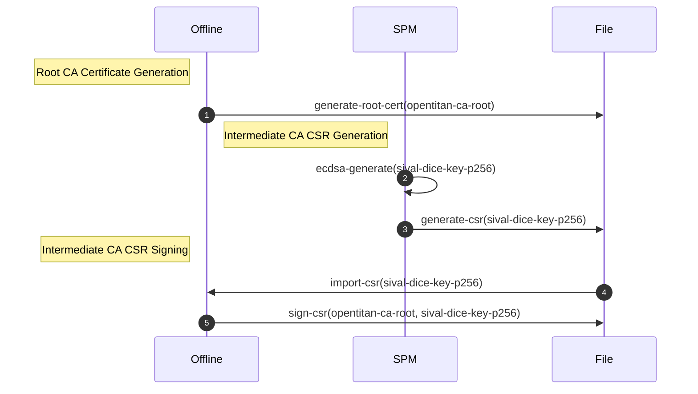
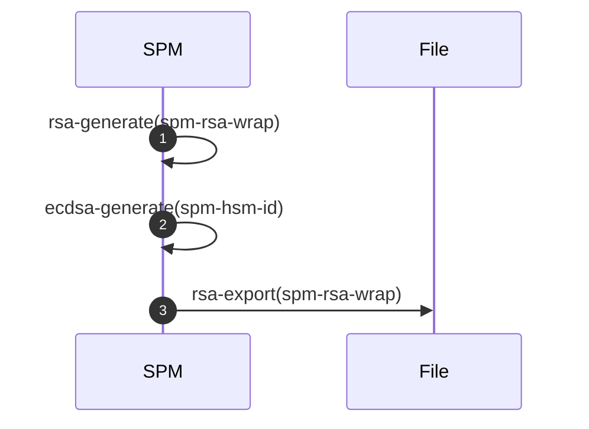
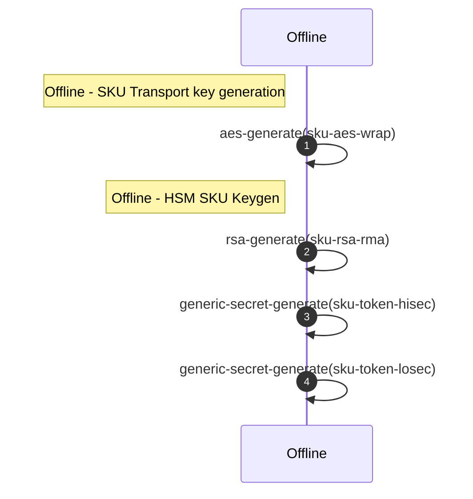
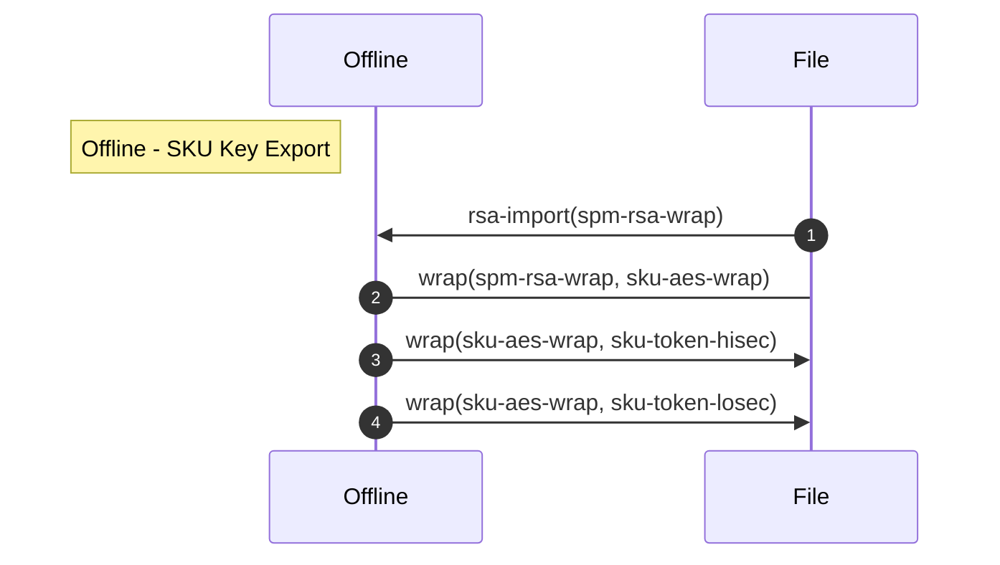
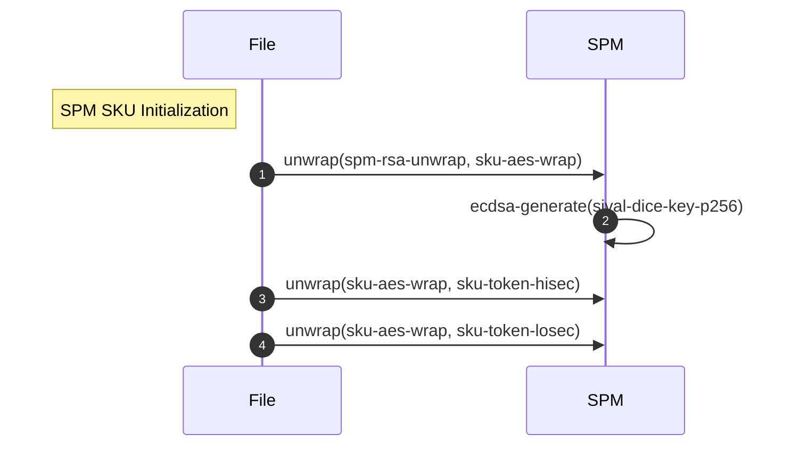

# HSM Configuration

This documents describes the `SPM` and `Offline` HSM configuration. The
following table summarizes all the assets managed across HSMs.

Asset | Offline | SPM | Type | Description
------|---------|-----|------|------------
`spm-rsa-wrap.pub`, `spm-rsa-wrap.priv` | Public | Private |  RSA 3072bit-F4 key pair | Key used to wrap `<sku>-aes-wrap`.
`spm-hsm-id` | Public | Private | ECDSA P-384 key pair | Key used to attest SPM operations, e.g. Device records are signed with this key to attest their provenance.
`<sku>-aes-wrap` | Yes | Yes | AES 256-bit key | Key used to wrap SKU specific assets. `<sku>` is used to identify the SKU.
`<sku>-endorse-cert-<application>-key` | Private | Private | ECDSA key pair | Keys used in `EndorseCert` operations. `<sku>` is used to identify the SKU, `<application>` is used to track the certificate type.
`<sku>-token-hisec` | Yes | Yes | 256-bit Generic Secret | Key used in token generation operations. The key is expected to be rotated frequently. `sku` is used to identify the SKU.
`<sku>-token-losec` | Yes | Yes | 256-bit Generic Secret | Key used in token generation operations. The key is expected to be rotated infrequently. `sku` is used to identify the SKU.

## SPM HSM Initialization

All HSMs used for manufacturing are audited to ensure their policies and
overall configurations are aligned with product requirements. The following
assets are then provisioned into the HSM to enable SKU operations.


Asset | Type | Description
------|------|------------
`spm-rsa-wrap.pub`, `spm-rsa-wrap.priv` | Public | Private |  RSA 3072bit-F4 key pair | Key used to wrap `<sku>-aes-wrap`.
`spm-hsm-id` | ECDSA P-256 key pair | Key used to attest SPM operations, e.g. Device records are signed with this key to attest their provenance.

## Offline HSM Initialization

### Transport Keys

The following keys are used to facilitate key wrap export of `SKU` specific
assets. All assets are exported with a wrapping key bound to a particular
`SPM`.

The HSM quorum is responsible for making sure that the `SPM` wrapping
key belongs to an HSM approved by the product owner.

Asset | Type | Description
------|------|------------
`<sku>-aes-wrap` | AES 256-bit key | Key used to wrap SKU specific assets. `<sku>` is used to identify the SKU.
`spm-rsa-wrap` | RSA 3072bit-F3 public key | Key used to wrap `<sku>-aes-wrap`.

Example:

```
sival-aes-wrap: Wrapping Key associated with Sival SKU.
spm-osat-rsa-wrap: SPM wrapping key bound to an HSM deployed at the OSAT.
```

### SKU Assets

The following assets are supported by the provisioning infrastructure. SKUs
may use one or more of the listed assets.

Asset | Type | Description
------|------|------------
`<sku>-endorse-cert-<application>-key` | ECDSA key pair | Keys used in `EndorseCert` operations. `<sku>` is used to identify the SKU, `<application>` is used to track the certificate type.
`<sku>-token-hisec` | 256-bit Generic Secret | Key used in token generation operations. The key is expected to be rotated frequently. `sku` is used to identify the SKU.
`<sku>-token-losec` | 256-bit Generic Secret | Key used in token generation operations. The key is expected to be rotated infrequently. `sku` is used to identify the SKU.

Example:

```
sival-endorse-cert-dice-key: DICE certificate endorsement key for the SiVal SKU.
sival-token-hisec: High security generic secret used for token generation.
sival-token-losec: Low security generic securet used for token generation.
```

##  End to End SKU Configuration

The following sequence diagram shows the end to end SKU provisioning flow
involving `Offline` and `SPM` HSMs.

Each SKU should have the following configuration bundles:

1. SPM HSM Initialization
2. SKU Initialization (Offline HSM)
3. SKU Export (Offline HSM)
4. SKU Import (SPM HSM)
5. Certificate Authority Operations

### Certificate Authority Operations

The certificate authority operations are split into three main steps:

1. Root CA Certificate Generation (Offline HSM)
2. Intermediate CA CSR Generation (SPM HSM)
3. Intermediate CA CSR Signing (Offline HSM)



### Build SKU

Build the release packages for the target SKU. The packages may also be
distributed directly by the SKU Owner to the Silicon Creator.

```shell
# Using Sival SKU as an example.
$ bazel build \
  //config/spm/sku:release \
  //config/spm/sku/sival:release

$ mkdir -p /tmp/sku-release
# The build output will be located under the `bazel-bin` folder:
$ cp bazel-bin/config/spm/sku/release.tar.gz \
  /tmp/sku-release/spm_init_release.tar.gz
$ cp bazel-bin/config/spm/sku/sival/release.tar.gz \
  /tmp/sku-release/sival_sku_release.tar.gz
```

### SPM HSM Initialization

The following steps cover the initialization of the SPM HSM. The following
sequence diagram describes the HSM operations.



1. Expand the contents of the `spm_init_release.tar.gz`.

```shell
$ tar xvf spm_init_release.tar.gz
```

2. Run initialization scripts.

```shell
# See config/env/prod/spm.env for an example of how to set the environment
# variables needed by the following commands.

# Initialize Keys.
$ ./spm_init.bash \
  -m "${HSMTOOL_MODULE}" \
  -t "${SPM_HSM_TOKEN_SPM}" \
  -p "${HSMTOOL_PIN}"

# Export Keys. `spm_export.tar.gz` will be required by the SKU initialization
# steps later.
$ ./spm_export.bash \
  -m "${HSMTOOL_MODULE}" \
  -t "${SPM_HSM_TOKEN_SPM}" \
  -p "${HSMTOOL_PIN}" \
  -o spm_export.tar.gz
```

> Note: The scripts will fail if there are any existing objects with matching
> labels in the HSM. The `-w` option can be used to destroy the objects before
> initialization. Make sure you only use the `-w` option if you have a way to
> recover the asset from a backup, or if you are ok with destroying the objects.
> Otherwise, contact the SKU owner and request them to change update the object
> labels.

### SKU Initialization



1. Expand the contents of `sival_sku_release.tar.gz`.

```shell
$ tar vxf sival_sku_release.tar.gz
```

2. Run initialization scripts.

```shell
# Generate SKU assets.
./offline_init.bash \
  -m "${HSMTOOL_MODULE}" \
  -t "${SPM_HSM_TOKEN_OFFLINE}" \
  -p "${HSMTOOL_PIN}"
```

### SKU Export



1. Expand the contents of `sival_sku_release.tar.gz`.

```shell
$ tar vxf sival_sku_release.tar.gz
```

2. Run SKU export scripts.

The following script generates a key export package specific for each SPM
HSM. The following parameters are important to note:

* `-i`: Should point to the SPM export package generated during the SPM
   initialization step. There should be one package per SPM HSM.
* `-o`: Should point to the SKU output bundle. This bundle will only work with
   the target SPM HSM associated with the `-i` option.
* `-w`: Use this flag if you are planning to run the SKU export flow several
  times. This ensures that the SPM wrapping key is removed before importing
  a new one. Inspect the contents of the `offline_export_down.hjson` file to
  make sure no other keys will be removed by using this option.

```shell
./offline_export.bash \
  -m "${HSMTOOL_MODULE}" \
  -t "${SPM_HSM_TOKEN_OFFLINE}" \
  -p "${HSMTOOL_PIN}" \
  -i spm_export.tar.gz \
  -w \
  -o offline_export_sival_sku.tar.gz
```

### SKU Import



1. Expand the contents of `sival_sku_release.tar.gz`.

```shell
$ tar vxf sival_sku_release.tar.gz
```

2. Run scripts

See `token_init.sh` script for examples.

## Troubleshooting

### Deleting objects with `hsmtool`

```shell
$ ./hsmtool -t <token-name> object destroy -l <object-label>
```